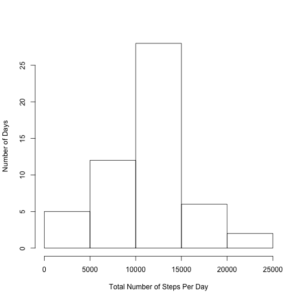

## Loading and preprocessing the data
This loads data from the file "activity.csv" and removes NA from the data.


```r
raw_data <- read.csv("activity.csv", header=TRUE, quote="\"")
complete_cases <- complete.cases(raw_data)
data <- raw_data[complete_cases, ]
```

## What is mean total number of steps taken per day?
Transform data frame into data table and uses data table to find the total steps taken per day. Displays in a histogram format


```r
library(data.table)
```

```
## data.table 1.9.4  For help type: ?data.table
## *** NB: by=.EACHI is now explicit. See README to restore previous behaviour.
```

```r
dt <- data.table(data)
total_steps_per_day <- dt[,sum(steps), by=date]
setnames(total_steps_per_day, c("date", "steps"))

mean_steps_per_day <- mean(total_steps_per_day$steps)
median_steps_per_day <- median(total_steps_per_day$steps)
graph <- hist(total_steps_per_day$steps, xlab = "Total Number of Steps Per Day", ylab = "Number of Days", main = "")
```

 

The mean number of steps per day is 10766.19. The median number of steps per day is 10765

## What is the average daily activity pattern?

We will plot a xy-plot of the daily activity using the lattice package of the number of steps averaged across the days agains the intervals.


```r
library(lattice)
steps_per_interval = dt[,mean(steps), by=interval]
setnames(steps_per_interval, c("interval", "steps"))
xyplot(steps_per_interval$steps ~ steps_per_interval$interval, ylab = "Average Number of Steps", xlab="Interval",type="l")
```

 

The maximum number of steps and time interval is


```r
max_value = max(steps_per_interval$steps)
steps_per_interval[steps == max_value]
```

```
##    interval    steps
## 1:      835 206.1698
```
## Imputing missing values

We will need to count the number of missing values by counting the number of NAs, which is the number of FALSE values in complete_cases

```r
sum(complete_cases == FALSE)
```

```
## [1] 2304
```

I will use the mean for the intervals to fill in the missing values in those intervals.

```r
filled_data = data.frame(raw_data)
for (i in 1:nrow(filled_data)){
  row <- filled_data[i,]
  if(is.na(row$steps)){
    interval <- row$interval
    steps <- steps_per_interval[interval==row$interval, ]$steps
    filled_data[i,]$steps <- steps
  }
}
dt_filled <- data.table(filled_data)
total_steps_per_day_filled <- dt_filled[,sum(steps), by=date]
setnames(total_steps_per_day_filled, c("date", "steps"))

mean_steps_per_day_filled <- mean(total_steps_per_day_filled$steps)
median_steps_per_day_filled <- median(total_steps_per_day_filled$steps)
graph <- hist(total_steps_per_day_filled$steps, xlab = "Total Number of Steps Per Day", ylab = "Number of Days", main = "")
```

 

The mean number of steps per day is 10766.19. The median number of steps per day is 10766.19. The mean doesn't change because I used the mean to fill in the missing values. The median has changed to reflect the mean value.

## Are there differences in activity patterns between weekdays and weekends?

Adding a new column to the data frame indicating weekday: TRUE or FALSE


```r
filled_data$weekday = weekdays(as.Date(filled_data$date))
filled_data$is_weekday = !(filled_data$weekday %in% c("Saturday", "Sunday"))
steps_per_interval_filled <- data.table(filled_data)[,mean(steps), by=list(interval, is_weekday)]
setnames(steps_per_interval_filled,"V1","steps")
steps_per_interval_filled$is_weekday = as.factor(steps_per_interval_filled$is_weekday)
levels(steps_per_interval_filled$is_weekday) <- c("Weekend", "Weekday")
xyplot(steps ~ interval | is_weekday, data = steps_per_interval_filled, type="l")
```

 
